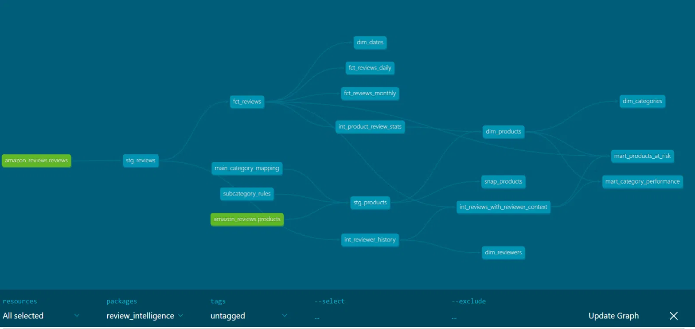
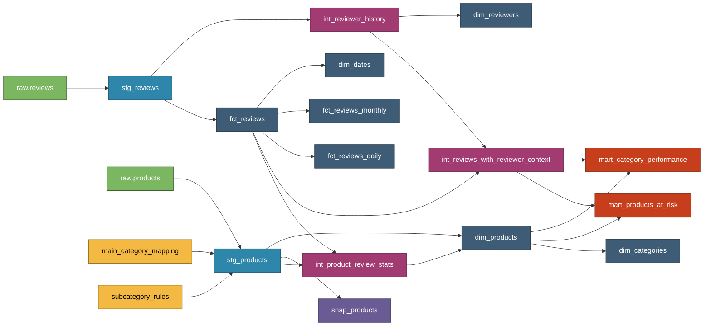
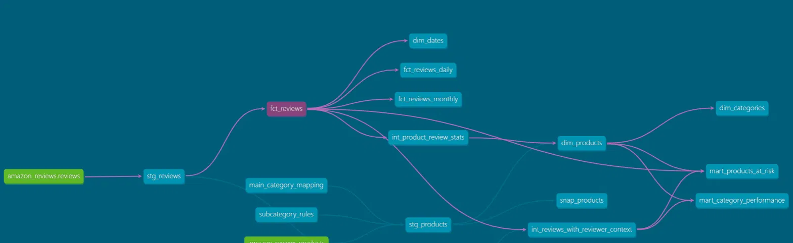
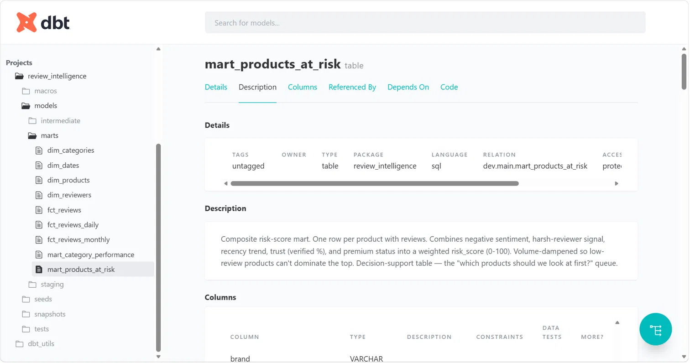

# dbt-review-intelligence

**A production-grade dbt + DuckDB analytics pipeline modeling 50K Amazon Beauty reviews across 3 layers (staging → intermediate → marts), with 113 automated tests and a decision-support "products at risk" mart.**

Built as portfolio piece #1 in a two-part series. Phase 2 adds an LLM enrichment layer for AI-driven review analytics — coming soon.

---

## 📊 The Warehouse at a Glance



- **2 sources** — Amazon Beauty reviews + product metadata (McAuley Lab 2023, via HuggingFace)
- **2 seeds** — category taxonomy + subcategory rules
- **2 staging models** — cleaned, typed, enriched
- **3 intermediate models** — reviewer harshness, product review stats, reviewer-context join
- **9 marts** — 4 dimensions (products, reviewers, categories, dates), 3 facts, 2 insight marts
- **1 snapshot** — SCD Type 2 on product metadata
- **113 tests** — not_null, unique, accepted_values, relationships, custom generic
- **3 exposures** — documented downstream consumers

Everything runs locally in ~90 seconds. Total cost: $0.

---

## 🎯 The Business Questions This Warehouse Answers

1. **Which products should we investigate first?** → `mart_products_at_risk` — weighted risk score (0-100) combining negative sentiment, harsh-reviewer signal, recency trend, and trust indicators, with volume dampening to prevent low-review noise.

2. **Which subcategories are struggling — and are harsh reviewers seeing something generous reviewers miss?** → `mart_category_performance` — segments performance by reviewer tendency; surfaces polarizing categories via a `polarization_score`.

3. **How are ratings trending over time?** → `fct_reviews_daily` + `fct_reviews_monthly` — daily and per-product-per-month rollups.

4. **Who are our most trustworthy reviewers?** → `dim_reviewers` — engagement bucket, rating consistency, `is_trusted_reviewer` composite flag.

---

## 🏗️ Architecture



**Legend:** 🟢 sources · 🟡 seeds · 🔵 staging · 🟣 intermediate · ⚫ marts · 🔴 insight marts · 🟪 snapshot

---

## 🛠️ Tech Stack

| Layer | Choice | Why |
|---|---|---|
| Transformation | **dbt Core 1.12** | Industry standard for analytics engineering |
| Warehouse | **DuckDB 1.10** | Zero-setup, embedded, blazing fast on local |
| Data | **HuggingFace Datasets** | Reliable, versioned public datasets |
| Language | **SQL + Jinja** | dbt's model language |
| Ingestion | **Python 3.11** | For loading raw data from HuggingFace into DuckDB |
| Package | **dbt_utils** | Surrogate keys, date spine, and more |

---

## 🚀 Reproduce This Locally

Prerequisites: Python 3.9+, ~2 GB free disk (dataset cache + warehouse).

```bash
# 1. Clone
git clone https://github.com/YOUR_USERNAME/dbt-review-intelligence.git
cd dbt-review-intelligence

# 2. Virtual environment
python -m venv venv
# Windows PowerShell:
venv\Scripts\Activate.ps1
# Mac/Linux:
source venv/bin/activate

# 3. Install
pip install dbt-duckdb datasets pandas pyarrow huggingface_hub

# 4. Load raw data from HuggingFace (~2 min first time; cached after)
cd review_intelligence
python data/load_raw.py
python data/load_products.py

# 5. Install dbt packages
dbt deps

# 6. Load seeds
dbt seed

# 7. Build everything (models + tests + snapshot)
dbt build
dbt snapshot

# 8. Explore the docs site
dbt docs generate
dbt docs serve
# → opens http://localhost:8080
```

Expected end state: 113 tests passing, ~90 seconds total runtime.

---

## 🧠 Design Decisions & Tradeoffs

Real analytics engineering is a series of tradeoffs. Here are the interesting ones:

### 1. Grain choice: `parent_asin` over `asin` for `product_id`

Amazon distinguishes between `asin` (variant IDs — a specific size/color) and `parent_asin` (the master product). I made `product_id = parent_asin` across the warehouse so all facts and dimensions join cleanly. `variant_id` (the old `asin`) is preserved in `stg_reviews` for anyone who needs sub-product granularity later.

**Discovered when:** The `relationships` test on `fct_reviews.product_id → dim_products.product_id` failed with 4,336 unmatched rows — a classic vocabulary mismatch between the reviews source (variant-level) and the products source (parent-level). Test caught it silently instead of a dashboard breaking on Monday morning.

### 2. Deduplication in `fct_reviews`

The `unique` test on `review_key` (surrogate hash of reviewer + product + timestamp) initially failed with 47 duplicates. Real cause: same reviewer submitting the same product's review multiple times at the same second (Amazon UI double-submits, or variants under one parent ASIN).

**Fix:** `row_number() OVER (partition by reviewer_id, product_id, reviewed_at ORDER BY review_text_length DESC, helpful_vote_count DESC)` — keep the row with the longest, most-upvoted version.

### 3. Rule-based categorization: intentionally imperfect

Amazon's source data has 2 categories for 112K products. I derived 12 subcategories via a keyword-regex seed (`subcategory_rules.csv`) applied in `stg_products`.

**Result:** ~36% of products get a clean subcategory. ~64% land in `Uncategorized`. There are false positives too ("Leather Conditioner" → Hair Care).

**Why not tune further:** Diminishing returns. Every additional rule is dataset-specific and doesn't generalize. Phase 2 replaces this layer with an LLM enrichment — a general approach that adapts to any product taxonomy.

This is a deliberate stopping point, not a bug.

### 4. Ephemeral intermediate models

Intermediate models materialize as `ephemeral` — dbt compiles them inline into downstream models rather than creating physical tables. This keeps the warehouse clean (no clutter) while giving all the reusability + testability benefits of a separate layer.

### 5. Volume-dampened risk score

`mart_products_at_risk.risk_score` multiplies the raw signal by a volume factor: 0.3 if <5 reviews, 0.7 if <20, 1.0 otherwise. Without this, a product with a single 1-star review would dominate the top of the "at risk" list. Real risk models always have this kind of dampener.

---

## 🧪 Data Quality: 113 Tests

| Test category | Examples |
|---|---|
| Structural | `not_null`, `unique` on all grain keys |
| Referential | `relationships` tests linking facts to dimensions |
| Enumeration | `accepted_values` on all categorical columns (sentiment_bucket, risk_tier, reviewer_tendency, category_health) |
| Custom generic | `positive_or_zero` on count/score columns |
| Source-level | `not_null` + `accepted_values` on raw fields |
| Freshness | `source freshness` config (pattern-only; data is static) |

Run: `dbt test`

---

## 📸 Screenshots

| | |
|---|---|
|  |  |
| Lineage view highlighting `fct_reviews` | `mart_products_at_risk` doc page |

---

## 🔮 What's Next: Phase 2 — LLM Enrichment

Phase 1 hit the ceiling of what rule-based categorization can do (36% coverage, false positives). Phase 2 adds an LLM enrichment layer that:

1. Reads review text via a batched, cached LLM call (Claude or GPT)
2. Extracts structured signals: sentiment (with confidence), topics, issue categories
3. Stages the output back into DuckDB as a new source
4. Feeds new marts: `fct_product_health_score`, `mart_rising_issues`, `dim_topics`
5. Recomputes `mart_products_at_risk` with LLM-derived signals

The `llm_enrichment_pipeline` exposure in the current codebase reserves the design space for it.

Post 2 will document that build. Follow the repo for the sequel.

---

## 📂 Project Structure

```
dbt-review-intelligence/
├── review_intelligence/          # dbt project root
│   ├── dbt_project.yml
│   ├── packages.yml
│   ├── .sqlfluff                 # linter config
│   ├── data/                     # Python loaders + inspection scripts
│   ├── seeds/                    # analytical taxonomy CSVs
│   ├── macros/                   # sentiment_from_rating, safe_divide
│   ├── models/
│   │   ├── staging/              # stg_reviews, stg_products + YAML
│   │   ├── intermediate/         # 3 ephemeral models + YAML
│   │   ├── marts/                # 4 dims + 3 facts + 2 insight marts
│   │   └── exposures.yml
│   ├── snapshots/                # snap_products (SCD Type 2)
│   └── tests/generic/            # positive_or_zero custom test
├── docs/screenshots/             # README visuals
└── README.md
```

---

## 🙌 Acknowledgments

- **Dataset:** [McAuley Lab Amazon Reviews 2023](https://amazon-reviews-2023.github.io/), sampled via HuggingFace.
- **Tooling:** [dbt Labs](https://www.getdbt.com/), [DuckDB](https://duckdb.org/), [dbt_utils](https://github.com/dbt-labs/dbt-utils).

---

## 📬 Connect

Built by Mahima Bhatt — targeting AI Data Engineer roles. Feedback and job leads welcome.

- LinkedIn: https://www.linkedin.com/in/mahima-bhatt-02223b190/
- Email: mahimakardambhatt@gmail.com